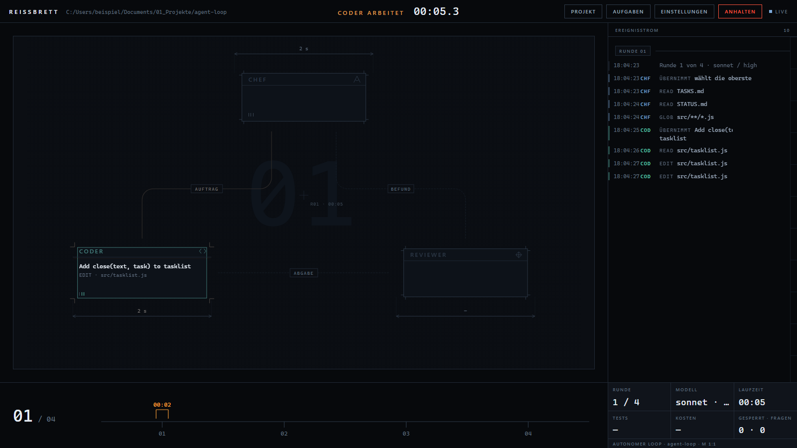

# Reissbrett

Ein Kontrollraum für den autonomen Agenten-Loop. Du siehst zu, wie Chef, Coder
und Reviewer sich die Arbeit zuschieben — und du steuerst alles von hier aus,
ohne Terminal.



## Starten

Doppelklick auf **`cockpit.cmd`**. Der Browser geht von selbst auf.

Oder im Terminal:

```bash
node server.js
```

Läuft ohne Installation: kein `npm install`, keine Abhängigkeit, kein Build.
Nur Node ab Version 20.

## Was du hier machst

| | |
|---|---|
| **Projekt** | Wählt aus, in welchem Repository der Agent arbeitet. Fehlt der Loop dort noch, richtet ein Klick ihn ein. |
| **Aufgaben** | `TASKS.md` bearbeiten — das ist der Auftrag. Eine Zeile pro Aufgabe, wichtigste oben. |
| **Einstellungen** | Testbefehl, Rundendeckel, Budget, Opus-Eskalationen. Schreibt direkt in `loop.sh`, damit ein Terminal-Lauf dieselben Werte bekommt. |
| **Starten** | Fragt nach der Rundenzahl und legt los. |
| **Anhalten** | *Sanft*: der Loop beendet die Runde, pusht und öffnet den Pull Request. *Hart*: sofort abschiessen — dann gibt es keinen PR. |

## Was du siehst

Die Zeichnung ist keine Dekoration, sondern der Zustand. Genau **ein** Bauteil
ist gross, hat farbige Kontur und amberfarbene Passkreuze: das ist die Rolle,
die gerade arbeitet. Genau **eine** Kante ist amber, und nur während der
Übergabe — dort fährt der Token entlang.

- **Masszahl** unter jedem Bauteil: wie lange diese Phase schon läuft. Eine
  Zahl, die wächst, unter etwas, das stillsteht.
- **Taktleiste** am unteren Innenrand: ein Strich je Werkzeugaufruf. Höhe und
  Farbe verraten die Art — lesend, schreibend, Shell, **geblockt**. Ein roter
  Strich bleibt als Narbe stehen.
- **Sperrtafel**: wenn ein Guard zuschlägt, hält das Bild an, über die Leitung
  kommt ein Doppelbalken, und die Tafel zitiert die Fehlermeldung wörtlich.
  Das ist der Moment, in dem das System dem Agenten etwas verweigert.
- **Rundenband** unten: jede Runde bekommt einen Stempel, grün oder rot. Die
  Schieblehre steht auf der laufenden.
- **»seit 24 s ohne Ereignis · denkt«**: wenn lange nichts passiert, sagt das
  Bild das, statt Betriebsamkeit vorzutäuschen.

## Vorher anschauen, ohne etwas zu starten

```
http://127.0.0.1:4173/?probe=1        eine Runde im Zeitraffer
http://127.0.0.1:4173/?probe=guard    der Moment, in dem ein Guard blockt
```

Kostet nichts, startet nichts, braucht kein Projekt.

## Wenn der Browser meckert

**`ERR_SSL_PROTOCOL_ERROR` / „kann keine sichere Verbindung bereitstellen"**

Chrome ruft die Adresse als `https` auf. Das Cockpit spricht nur `http` — es
verlässt den Rechner nie, eine Verschlüsselung gegen sich selbst brächte
nichts. Drei Wege, von schnell nach dauerhaft:

1. **`http://localhost:4173` statt `127.0.0.1`.** Chrome merkt sich den
   HTTPS-Zwang pro Hostname; `localhost` ist meist nicht betroffen. Deshalb
   öffnet das Cockpit diese Adresse von sich aus.
2. **Den gemerkten Zwang löschen:** `chrome://net-internals/#hsts` öffnen, unten
   bei *Delete domain security policies* nacheinander `127.0.0.1` und
   `localhost` eintragen und auf *Delete* klicken.
3. **Die Einstellung abschalten:** Einstellungen → Datenschutz und Sicherheit →
   Sicherheit → *Immer sichere Verbindungen verwenden* aus.

**Die Seite lädt gar nicht.** Schau ins schwarze Fenster, das `cockpit.cmd`
geöffnet hat — dort steht, was fehlt. Läuft schon ein Cockpit, sagt es das und
öffnet stattdessen jenes.

**Das Fenster geht auf und sofort wieder zu.** Dann fehlt Node.js. Hol es von
[nodejs.org](https://nodejs.org) und starte `cockpit.cmd` neu.

## Einstellungen des Cockpits selbst

Als Umgebungsvariablen, alle optional:

| Variable | Standard | wofür |
|---|---|---|
| `COCKPIT_PORT` | `4173` | Port. Ist er belegt, nimmt das Cockpit den naechsten freien. Laeuft dort schon ein Cockpit, oeffnet es stattdessen jenes. |
| `COCKPIT_WURZEL` | der Ordner über dem Cockpit | wo nach Projekten gesucht wird |
| `COCKPIT_SCAFFOLD` | `../agent-loop` | woher der Loop beim Einrichten kopiert wird |
| `COCKPIT_BASH` | automatisch gesucht | Pfad zur `bash.exe`, falls sie woanders liegt |
| `COCKPIT_KEIN_BROWSER` | — | gesetzt: Browser nicht automatisch öffnen |

## Wie es gebaut ist

Drei Teile, bewusst klein:

- **`server.js`** — lokaler HTTP-Server, hört nur auf `127.0.0.1`. Live-Daten
  über Server-Sent Events; ein WebSocket wäre mehr Maschinerie für weniger.
- **`lib/`** — Projekte finden und einrichten, `loop.sh` konfigurieren, den Lauf
  starten und seinen Ereignisstrom deuten.
- **`public/`** — die Oberfläche. Ein HTML, ein CSS, ein JS. Kein Framework,
  kein CDN, keine Schriftdatei. Läuft offline und in fünf Jahren noch.

Die Live-Daten kommen aus zwei Quellen, die absichtlich getrennt bleiben: die
Ausgabe von `loop.sh` sagt, was das **Skript** entschieden hat (Rundenkopf, rote
Suite, Abbruchgrund), und `.agents/round-N.ndjson` sagt, was in der **Runde**
passiert ist (Rollenwechsel, Werkzeuge, Guards). Diesen Strom schreibt `loop.sh`
nur, wenn `AGENT_LOOP_EVENTS=1` gesetzt ist — das Cockpit tut das, ein
Terminal-Lauf bleibt unverändert.

Die tragende Regel im Frontend: **die Oberfläche wird immer vollständig aus dem
Zustandsobjekt gezeichnet**, nie aus einer Abfolge von Animationen. Animationen
werden von Zustandsänderungen ausgelöst, aber sie besitzen keinen Wert. Sonst
hängt nach einem verpassten Ereignis für immer die falsche Rolle gross auf dem
Schirm, und nichts repariert das je.

## Was es nicht tut

Es ersetzt die Guards nicht und den Pull Request nicht. Der Loop bleibt die
Maschine; das Cockpit ist die Scheibe davor. Wenn der Server abstürzt, läuft der
Loop weiter — er hängt nicht am Cockpit.

Und es hat keine Rechteverwaltung. Es darf Prozesse starten und Dateien in
deinen Projekten schreiben. Deshalb hört es nur auf `127.0.0.1` und gehört
nicht ins Netz.
